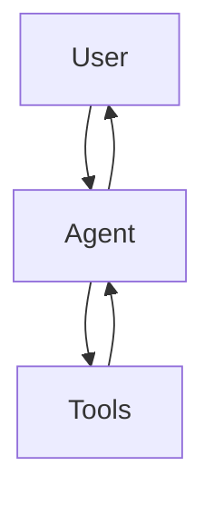

# The Big Book of Agent Ops

A comprehensive guide to deploying quality agentic applications safely and reliably.

## 🚀 Quick Start

### Prerequisites
- **Python 3.9+** 
- **Quarto CLI** - [Install here](https://quarto.org/docs/get-started/)

### Setup (< 5 minutes)

1. **Clone and navigate**
```bash
git clone <repo-url>
cd big-book-of-agent-ops
```

2. **Create virtual environment**
```bash
python3 -m venv venv
source venv/bin/activate  # On Windows: venv\Scripts\activate
```

3. **Install dependencies**
```bash
pip install -r requirements.txt
```

4. **Start writing!**
```bash
./preview.sh  # Live preview at http://localhost:4200
```

## 📖 Building the Book

### Local Development
```bash
# Live preview with auto-reload
./preview.sh

# One-time build  
./build.sh

# View built book
open _book/index.html
```

### Output Formats
- **HTML** (default): Interactive web book
- **PDF**: Print-ready version

## 🤝 Contributing

### Writing Guidelines

1. **Use `.qmd` format** for rich content (code, diagrams, math)
2. **Follow existing structure** in `_quarto.yml`
3. **Include practical examples** - this is a hands-on guide
4. **Test all code snippets** before submitting

### Adding New Content

#### New Chapter
1. Create `.qmd` file in appropriate `partN/` directory
2. Add to `_quarto.yml` under relevant part
3. Use this template:

```markdown
# Chapter Title

Brief intro paragraph.

## Section 1

Content with examples:

```python
# Working code example
def example_function():
    return "Hello Agent Ops!"
```

## Section 2

More content...
```

#### Diagrams
Use Mermaid for architecture diagrams:



#### Code Examples
- **Include working examples** in `examples/` directory
- **Reference real tools**: MLflow, LangChain, Databricks
- **Show complete implementations**, not just snippets

### Content Areas Needed

- [ ] **Part 1: Background** - Agent vs LLM vs RAG comparisons
- [ ] **Part 2: Principles** - DevOps applied to agents  
- [ ] **Part 3: Implementation** - Real deployment examples
- [ ] **Examples** - Complete agent implementations
- [ ] **Case Studies** - Production stories and lessons learned

### Review Process

1. **Create branch** for your changes
2. **Test locally** with `./preview.sh`
3. **Submit PR** with clear description
4. **Address feedback** from reviewers
5. **Merge** after approval

## 📁 Repository Structure

```
big-book-of-agent-ops/
├── _quarto.yml          # Book configuration
├── index.qmd            # Home page
├── part1/               # Background and Context
├── part2/               # Principles of Agent Ops  
├── part3/               # People, Process, Technology
├── examples/            # Complete code examples
├── assets/              # Images and diagrams
├── references/          # Bibliography
├── build.sh             # Build script
├── preview.sh           # Preview script  
└── requirements.txt     # Python dependencies
```

## 🛠️ Troubleshooting

### Common Issues

**"Quarto not found"**
```bash
# Install Quarto CLI from https://quarto.org/docs/get-started/
# Or with conda:
conda install -c conda-forge quarto
```

**"Python dependencies missing"**
```bash
# Make sure virtual environment is activated
source venv/bin/activate
pip install -r requirements.txt
```

**"Code examples not working"**
- Check Python version (3.9+ required)
- Verify all imports are in `requirements.txt`
- Test in clean virtual environment

### Getting Help

- **Issues**: Use GitHub issues for bugs or content suggestions
- **Discussions**: Use GitHub discussions for questions
- **Chat**: Join our [community chat] (if available)

## 🎯 Goals

This book aims to be:
- **Practical**: Real examples you can use immediately
- **Comprehensive**: Cover the full agent lifecycle
- **Community-driven**: Built by practitioners, for practitioners
- **Up-to-date**: Reflect current best practices and tools

## 📄 License

[Choose appropriate license - MIT, CC BY-SA, etc.]

---

